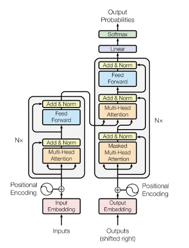
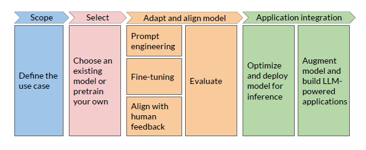
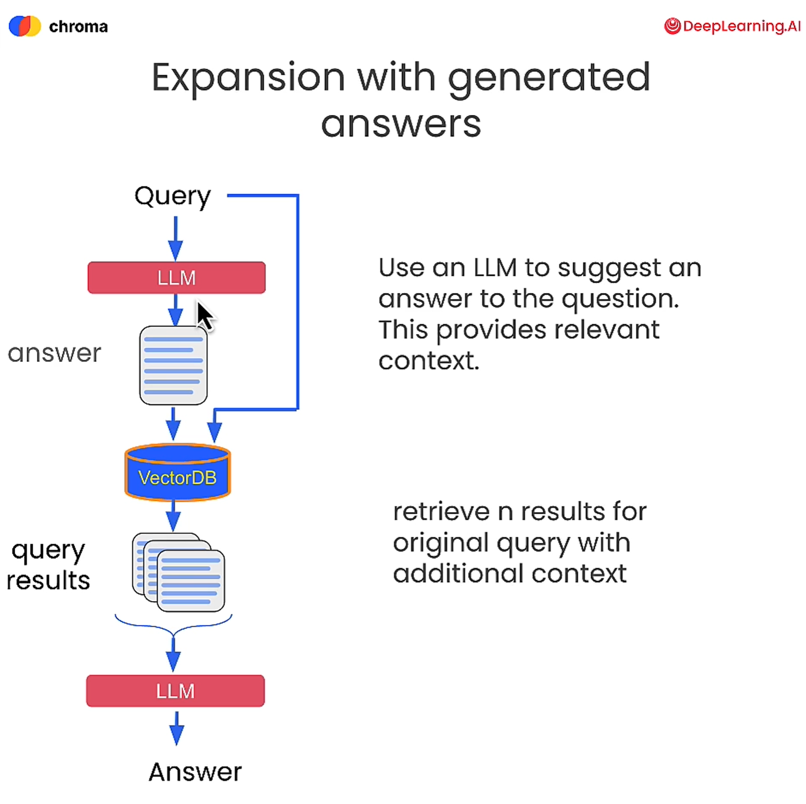
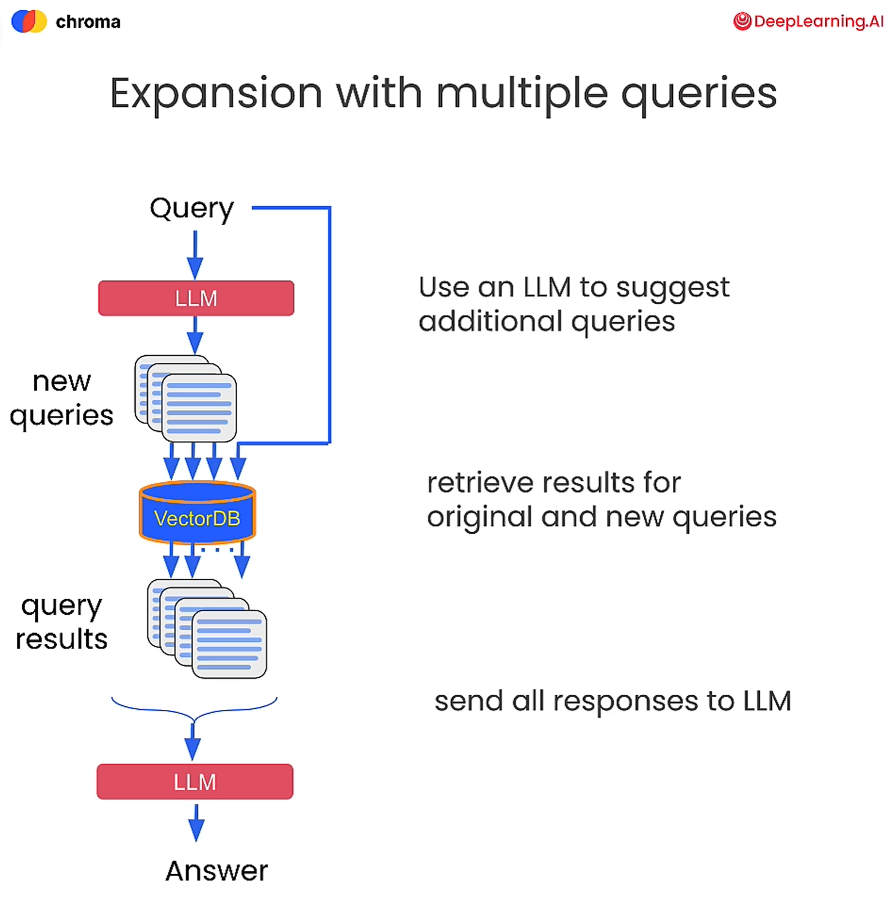
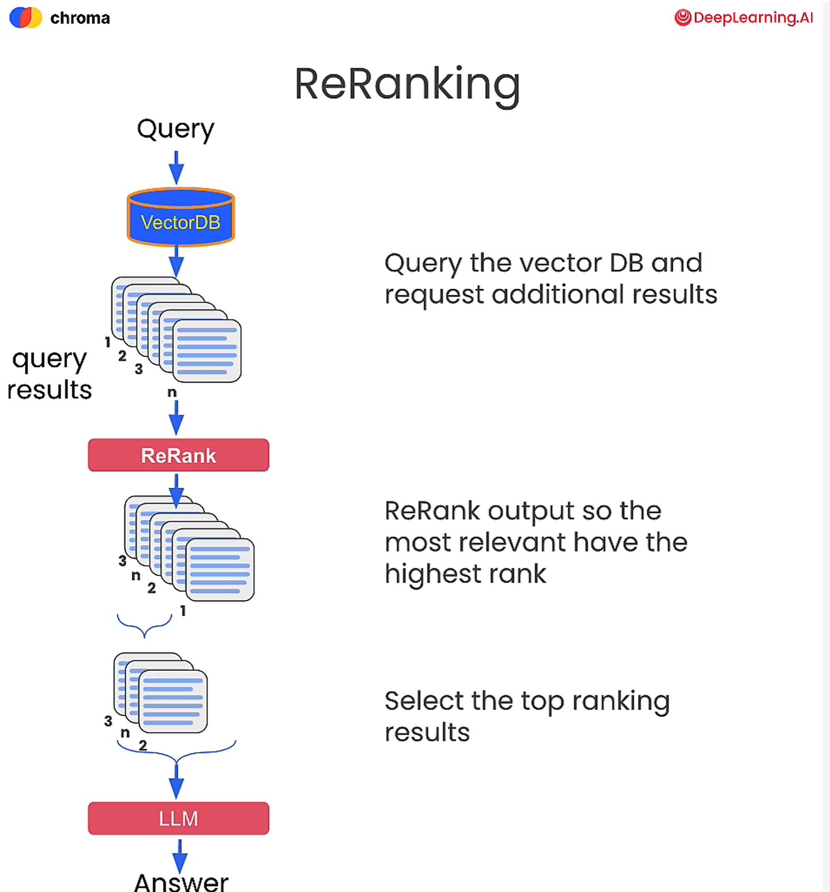

Co-Pilots & App Development with Large Language Models starter package.

# Contents

1. [Introduction](#introduction)
1. [Common Patterns](#common-patterns)
    - [Conversational Bot](#conversational-bot)
    - [Process Automation](#process-automation)
    - [Decision Tree or Flow Orchestration](#decisigion-tree-or-flow-orchestraction)
1. [Suggested Learning](#suggested-learning-resources)
    - [LLM](#llm)
    - [App Development](#app-development)
    - [Quality](#quality)
    - [Introductory courses to Vector DBs](#introductory-courses-to-vector-dbs)
    - [Additional resources](#additional-resources)
1. [Development](#development)
    - [SDKs / Frameworks](#sdks--frameworks)
    - [RAG pattern](#rag-pattern)
    - [Plugins, Tools and Functions](#plugins--tools-and-functions)
    - [Assistants, Agents, and Planners](#assistants--agents-and-planners)
1. [Vector DB](#vector-db)
1. [Microsoft Copilot Studio - No Code / Low Code Development](#microsoft-copilot-studio---no-code--low-code-development)

# Introduction

This repository serves as a documentation of the learning journey in utilizing Large Language Models (LLMs) for app development. It covers various topics including the RAG pattern, Vector DBs, Semantic Kernel, LangChain, and Microsoft Copilot Studio. Additionally, it explores common usage patterns observed among ISVs and startups. The content is aimed at app developers and app architects.


# Common Patterns

The terms Copilot, Bot, or Virtual Assistant are often used interchangeably to refer to assistance that relies on Large Language Models (LLMs). This assistance can have a user interface (UI) or voice interface, or it could be invisible as part of background processes.

Here are common patterns that ISVs and Startups are using with LLMs:

## Conversational Bot

Conversational bots often utilize LLMs to interact with end users. These bots receive user queries and generate responses using LLMs. However, LLMs are not domain-specific by default. To make LLMs domain-specific, developers employ the [RAG pattern](#rag-pattern).  Addutionally to RAG pattern developerd will also need to develop bot.  Bot could be developed usign [Bot Framework SDK](https://learn.microsoft.com/azure/bot-service/bot-service-overview?view=azure-bot-service-4.0).

As an alternative, developers can deliver conversational bot with no-code/low-code approach using [Microsoft Copilot Studio](#microsoft-copilot-studio---no-code--low-code-development).

## Process Automation

LLMs are being utilized in tasks traditionally performed by humans. For instance, in recruitment agencies, recruiters analyze job descriptions and resumes to match candidates with suitable roles. Automating this process has been challenging for app developers, but with the help of LLMs, it becomes much easier. Here's a possible solution: 
1. Extract key characteristics from job descriptions using LLMs.
2. Use LLMs to scan resumes and identify the best fit for a role based on those key characteristics.

The same approach can be applied to other processes, such as checking if documents meet specific requirements or policies.

For more information on how to implement these scenarios, please refer to the [SDKs / Frameworks](#sdks--frameworks) section and the [Orchestration / Agents](#orchestration--agents) section later in this document.

## Decisigion Tree or Flow Orchestraction

In call center solutions, Large Language Models (LLMs) can be utilized to determine the intent of customer queries. This intent can then be used to route the call to the appropriate agent or flow. LLMs can also generate responses to customers. If a customer wants to execute an action, the LLM can collect the necessary details and call a corresponding function.  Similarly as in Process Automation scenario, this can be implemented with [SDKs / Frameworks](#sdks--frameworks) and [Orchestration / Agents](#orchestration--agents).

For more detailed information on Call Center, Support, and Process Automation, you can refer to the [CoE.ContentPack.CallCenter](https://github.com/RobertEichenseer/CoE.ContentPack.CallCenter) repository.

# Suggested Learning Resources

To effectively integrate Large Language Models (LLMs) into app development, it's crucial to have a solid understanding of LLMs. Therefore, this section presents a list of learning resources. For optimal learning, it is advised to pursue the courses in the sequence provided below.


## LLM

- For an amazing introductory course on LLMs, check out the DeepLearning.AI course [Generative AI with Large Language Models (20+h)](https://www.coursera.org/learn/generative-ai-with-llms). This course provides a strong foundation in understanding LLMs, including the Attention Is All You Need algorithm, language model workings, embedding, and the challenges with Large Language Models. It also covers finetuning strategies and how smaller fine-tuned models can achieve comparable or even better results than large models.
    
    
    *Attention Is All You Need algorithm*

    Course also dives into Generative AI project lifecycle.
    
    
    *Generative AI project lifecycle*

- If you prefer a shorter introduction, you can watch the [Intro to Large Language Models (1h)](https://www.youtube.com/watch?v=zjkBMFhNj_g) video.

## App Development

> DeepLearning.AI is often recomened in this section. DeepLearning.AI is led by a team of instructors from Stanford University and deeplearning.ai, offers a comprehensive platform for learning AI development. They provide a wide range of courses, specializations, and professional certificates.

- Prompt engineering refers to the practice of crafting and optimizing input prompts by selecting appropriate words, phrases, sentences, punctuation, and separator characters to effectively use LLMs for a wide variety of applications. In other words, prompt engineering is the art of communicating with an LLM.  Refer to these resources to learn more about prompt engineering:
    - [ChatGPT Prompt Engineering for Developers (2h)](https://learn.deeplearning.ai/chatgpt-prompt-eng)
    - [Prompt Engineering](https://platform.openai.com/docs/guides/prompt-engineering) article from OpenAI are recommended resources for learning prompting techniques.
- There are two main approaches to send prompts to LLM:
    - Leveraging API libraries
    - Using SDKs/Frameworks that utilize API libraries
    
    We will review API libs and SDKs/Frameworks later in this document but for now complete some of the following courses to get a better understanding how to send prompts to LLMs:

    - [LangChain for LLM Application Development (2h)](https://learn.deeplearning.ai/langchain/) provides insights into using LangChain for LLM development.
    - [LangChain Chat with Your Data (2h)](https://learn.deeplearning.ai/langchain-chat-with-your-data/) is a course that demonstrates the use of LangChain for the RAG pattern.
    - [How Business Thinkers Can Start Building AI Plugins With Semantic Kernel (2h)](https://learn.deeplearning.ai/microsoft-semantic-kernel/) introduces Semantic Kernel (SK) and provides guidance on building AI plugins with it.

### Quality.

Verifying the quality of responses generated by LLMs in applications is an emerging area in software development. The courses listed below offer valuable insights into this process:

- [Evaluating and Debugging Generative AI (2h)](https://learn.deeplearning.ai/evaluating-debugging-generative-ai) is a course that explains how to use LLM to validate responses.
- [Quality and Safety for LLM Applications (2h)](https://learn.deeplearning.ai/quality-safety-llm-applications/) another great quality and safety of outputs. 

### Introductory courses to Vector DBs.
- [Advanced Retrieval for AI with Chroma (2h)](https://learn.deeplearning.ai/advanced-retrieval-for-ai/)
- [Vector Databases: from Embeddings to Applications (2h)](https://learn.deeplearning.ai/vector-databases-embeddings-applications/) - utilizes Weaviate

For more great courses on LLMs, visit [DeepLearning.AI Short Courses](https://learn.deeplearning.ai/). DeepLearning.AI constantly adds new courses, so it is recommended to check back often. As of the beginning of 2024, DeepLearning.AI remains one of the foundational sources for learning about LLMs and app development leveraging LLMs.

### Additional resources

- [LangChain Course](https://www.youtube.com/playlist?list=PLqZXAkvF1bPNQER9mLmDbntNfSpzdDIU5): A comprehensive course exposing interesting patterns, although code samples could be outdated.
- [Develop Generative AI solutions with Azure OpenAI Service](https://learn.microsoft.com/en-gb/training/paths/develop-ai-solutions-azure-openai/): Light courses from Microsoft.
- Short but very saturated videos on Azure Open AI:
    - [Introduction to Azure OpenAI and Architecture Patterns](https://www.youtube.com/watch?v=TI85JJVPnrM)
    - [Azure OpenAI Chat With Your Data No Code Edition](https://www.youtube.com/watch?v=tFJNasjGM3E)


# Development


After completing the recommended courses from the previous section, you will have a solid understanding of application development with LLMs.  In this section want to add more clarity on how to develop applications with LLMs.

> ### Shift from Algorithmic to Heuristic Software
> Application development leveraging LLM offers a shift from algorithmic approaches to heuristic methods. Heuristic methods utilize available data to solve problems, rather than relying on predefined solutions. While heuristic solutions may not always be provable or completely accurate, they are often sufficient for solving small-scale problems within a larger context.
> **Heuristics vs. Algorithms.**  Algorithms provide step-by-step instructions for solving a specific problem in a finite number of steps. The outcome of an algorithm is predictable and can be reliably reproduced with the same input. On the other hand, heuristic outcomes are educated guesses. They cannot be predicted or reproduced reliably.

## SDKs / Frameworks


When developing solutions that utilize Large Language Models (LLMs), you have the choice of using API Libraries or SDKs/Frameworks. API Libraries are used to build requests, execute and parse requests to LLM endpoints. On the other hand, SDKs/Frameworks provide additional convenient features for developers while internally using API libraries.

While it is feasible to solely rely on API libraries, leveraging SDKs/Frameworks can expedite solution development and reduce code complexity. Therefore, it is recommended to utilize SDKs/Frameworks whenever possible.

> **Important Note:** Code-related educational material can quickly become obsolete due to the constant evolution of libraries and SDKs. It is recommended for learners to focus on application development patterns rather than specific syntax, as patterns are more resistant to change. Refer to official tutorials and documentation for the most up-to-date information.


|                     | [OpenAI](https://platform.openai.com/docs/libraries/python-library)  | [Azure Open AI](https://learn.microsoft.com/en-us/azure/ai-services/openai/supported-languages) | [Semantic Kernel](https://learn.microsoft.com/en-us/semantic-kernel/overview/) | [LangChain](https://www.langchain.com/)       | [LlamaIndex](https://www.llamaindex.ai/)      |
| ------------------- | ----------- | ----------------- | --------------- | --------------- | --------------- |
|                     | API Library | API Library / Service SDK | SDK / Framework | SDK / Framework | SDK / Framework |
| Open Source              | yes         | yes               | yes             | yes             | yes             |
| OpenAI and Azure OpenAI models | yes         | yes               | yes             | yes             | yes             |
|                     |             |                   |                 |                 |                 |
| Framework Features (Memory, Orchestration, Agents...) |  -        |  -                | yes             | yes             | yes             |
|                     |             |                   |                 |                 |                 |
| - C#                  | yes         | yes               | yes             |  -              |  -              |
| - Python              | yes         | yes               | yes             | yes             | yes             |
| - JS                  | yes         | yes               |  -              | yes             | yes             |

The table above shows only three languages, but API Libraries are available for many more languages.  It is also important to note that updates in models are first reflected in API Libraries and later SDKs/Frameworks.

Traditionally Python has the biggest list of AI related libraries due to the largest AI research and development community. However, the C# AI community is rapidly growing thanks to the Semantic Kernel and C# API Libarires. On the other hand, JavaScript, despite being a popular language, currently lacks a string community around LLM.

When working with customers, we have observed that the most important factor in choosing an SDK/Framework is the team's expertise as most Libraries and SDKs are very similar in terms of functionality and performance.

If your team plans using c# then check out the comprehensive resource on Semantic Kernel - [Dive into the World of AI with the Semantic Kernel Cookbook](https://techcommunity.microsoft.com/t5/educator-developer-blog/dive-into-the-world-of-ai-with-the-semantic-kernel-cookbook/ba-p/4032668?WT.mc_id=academic-0000-abartolo).

### Code Samples
This repo contains samples for the following SDKs:

- [Semantic Kernel, C#, .NET 8](/samples/CSharp/)
- [LangChain, Python](/samples/LangChain/)


### Recomendations regarding Performance, Stability and Cost

- Latency is a significant challenge for solutions like a call centers where AI-powered virtual agents assist human agents.  Customers sometimes have to wait longer for a responce that's comming from LLM.  To mitigate such wait time during the call develops fill the wait time with the call-waiting messages like: "Mm,s" or leyboar typing.
- LLM latency in UI interfaces can be masked by leveraging Streaming. For more information, refer to the [OpenAI Streaming](https://platform.openai.com/docs/api-reference/streaming) and [Azure Open AI API reference](https://learn.microsoft.com/en-us/azure/ai-services/openai/reference#:~:text=stream) documentation.
- LangChain and LlamaIndex provide caching Functionality. LlamaIndex also offers ability to leferage remote cache like remote Redis. This feature offers two advantages: it can help reduce costs by minimizing the number of API calls to the LLM provider and improve responsiveness.
- While building SaaS/Multitenant solution it's recomened to review [Multitenancy and Azure OpenAI Service](https://learn.microsoft.com/azure/architecture/guide/multitenant/service/openai) article.  It's provides guidance on how to implement multitenancy with Azure OpenAI Service.
- Putting API Management in front of two or more Azure OpenAI services can increase the number of tokens per minute (TPM) and improve stability by implementing retry logic for failed requests. You can refer to the sample code for implementing [Azure OpenAI Service Load Balancing with Azure API Management](https://learn.microsoft.com/en-us/samples/azure-samples/azure-openai-apim-load-balancing/azure-openai-service-load-balancing-with-azure-api-management/).  More advanced implementaion based on NGINX and AKS can be found in the article - [Azure OpenAI Service Multitenant Load Balancing and Token Per Minute Tracking via Prometheus Metrics](https://techcommunity.microsoft.com/t5/fasttrack-for-azure/azure-openai-service-multitenant-load-balancing-and-token-per/ba-p/3980163)


##  RAG pattern
The RAG (Retrieval-Augmented Generation) pattern used with Large Language Models (LLMs) like GPT-3 is a machine learning approach that enhances the capabilities of generative models by combining them with retrieval-based models. This technique allows the LLM to access a broader range of information than what is contained in its training data, improving its performance in tasks that require specific, detailed, or up-to-date knowledge.

[LangChain Chat With Your Data](https://learn.deeplearning.ai/langchain-chat-with-your-data) is a course that covers loading, chunking, and retrieval tactics used in RAG pattern leveraging LangChain.  The article [Advanced RAG: Small to Big Retrieval](https://towardsdatascience.com/advanced-rag-01-small-to-big-retrieval-172181b396d4) discusses Child-Parent Recursive Retriever and Sentence Window Retrieval with LlamaIndex. It also explores retrieval strategies such as Child to Parent and Window.  Semantic Kernel, combined with [Kernel Memory][def], can be utilized to implement the Retrieval-Augmented Generation (RAG) pattern.

When implementing the RAG pattern, it is important to use tools that you are familiar with for troubleshooting and debugging. Latency issues may arise at different stages of the pattern, requiring you to check logs for the Vector DB, LLM provider, and the SDK/Framework being used. Monitoring the performance of the RAG pattern is also crucial. This includes tracking the number of requests to each component (LLM provider, Vector DB, and SDK/Framework), as well as monitoring latency and cost.

### RAG stages


#### 1. Loading

Loading is the initial stage in the RAG pattern, where data/text is obtained from various sources and formats before it is chunked and stored in a Vector DB.

LangChain provides loading capabilities from different sources and formats. Initially, Semantic Kernel had this feature, but it was later extracted to [Kernel Memory](https://github.com/microsoft/kernel-memory).

#### 2. Chunking / Splitting
Automatic chunking is challenging when dealing with documents of different formats. Some customers have manually converted important PDFs to text and then chunked them to achieve better retrieval and completion results.

> Chunking is a crucial stage in the RAG pattern. It involves considering not only the size of the chunk but also its content. For example, if a document has 100 pages and only 1 paragraph is relevant to the question, it should be chunked in a way that separates the relevant paragraph into its own chunk. This allows for specific retrieval and prompt generation.

The quality of retrieval heavily relies on the quality of chunking. There is ongoing experimentation to achieve optimal and intelligent chunking.

#### 3. Embedding and Storage to Vector DB

Embeding data and storing to vector DB is the next stage in the RAG pattern.  Some Vector DBs automatically generate embeddings as you save data. For more information, refer to the [Weaviate DB Course](https://learn.deeplearning.ai/vector-databases-embeddings-applications).

To ensure optimal retrieval and completion results, it is crucial to use the same model for creating embeddings of both chunks and questions. However, organizations may face challenges if the original embedding model becomes outdated or unavailable. To address this, consider the following options:

- Choose an embedding model with a distant deprecation date.
- Save the raw text of chunks along with their vectors, allowing for regeneration of embeddings using a newer model if necessary (although this may increase costs).
- Download the embedding model and host it on your own infrastructure, ensuring continued use even after deprecation (but incurring additional costs).


#### 4. Retrieval

There are different strategies for retrieval. Some DBs provide configurable hybrid retrieval strategies. The retrieval practices are evolving, and we see that VectorDBs are taking ownership over this stage as it makes sense to filter data as close to the data source as possible. They are adding more and more features to support different retrieval strategies.  Retrieval is also an active space for research and development.


Here are some resources for advanced retrieval tactics:

- [Advanced Retrieval tactics using LlamaIndex](https://towardsdatascience.com/advanced-rag-01-small-to-big-retrieval-172181b396d4).  Article Discusses "Smaller Child Chunks Referring to Bigger Parent Chunks" and "Sentence Window Retrieval" taktics.
- [Advanced Retrieval for AI with Chroma and OpenAI SDK](https://learn.deeplearning.ai/advanced-retrieval-for-ai).  This course covers the [Query Expansion](https://arxiv.org/abs/2305.03653) and Re-ranking strategies to improve retrieval results:
    - Advanced Retrieval strategy: Query Expansion by Prompting Large Language Models     
    [](content/imgs/QueryExpansion.png)

    - Advanced Retrieval strategy: Query Expansion by Prompting Large Language Models     
    [](content/imgs/QueryExpansionWithMultp.png)

    - Re-Ranking     
    [](content/imgs/ReRanking.png)
- LangChain has also implemented multiple [retrieval strategies](https://python.langchain.com/docs/modules/data_connection/retrievers/).


**Choice of Search types in RAG:**

The choice of the search types – **Text, Vector search** or **Hybrid Search** will depend on the use case.

- **Text Search:** Also known as keyword search where search is executed by matching keywords. The scoring is mostly done using BM25similarity which is based on TF-IDF (Term Frequency-Inverse Document Frequency and ranking by popular algorithm, BM25.
    
    This type of search is quite useful where:

    1. Exact keyword matching is required.
    2. [proximity search](https://en.wikipedia.org/wiki/Proximity_search_(text)) where documents are searched in which the keyword occur within a specified distance with another keyword irrespective of the order.

- **Vector Search:** Vector search involves encoding data and search queries as numerical vectors and using geometric or algebraic operations to determine similarity. It allows for semantic search by finding the closest data vectors to a query vector in a high-dimensional space, using measures like cosine similarity.
    
    This is useful where:

    1. Retrieval of relevant results based on meaning and context is required e.g. In the case of natural language processing, recommendation systems etc.
    2. Can handle situations where multiple forms of data like text, image and audio must be interpreted and then retrieve information. E.g.: retrieval of text and images in a search query.

- **Hybrid Search:** Hybrid search allows you to take advantage of multiple scoring algorithms such as BM25 and ANN vector similarity so you can get the benefits of both keyword search and semantic search.
    
    This type of search is useful in situations where the different scenarios mentioned in Text Search and Vector Search are required together.


#### 5. Prompting

For a comprehensive list of strategies and tactics for prompting, you can refer to the [Prompt Engineering by OpenAI](https://platform.openai.com/docs/guides/prompt-engineering) guide. Additionally, you can find a compilation of prompting techniques in one place at the [Prompt Engineering Guide](https://www.promptingguide.ai/).


## Plugins, Tools and Functions

LLMs are time capsules that do not have access to data or services. One way to provide context to LLMs is by using plugins. They can be used to provide context to LLMs, such as current weather forecasts or available products in a store. Plugins serve as a means to ground context for LLMs.


Frameworks use different terminology for plugins. For example, in Semantic Kernel, they are called "Plugins". In LangChain, they are called "Tools". In OpenAI, they are called "Functions". Additionally, the way plugins are created may vary between frameworks.  For example, in Semantic Kernel, plugins are created as a class with a method that is decorated with a KernelFunction attribute.  Here is an example of a plugin in Semantic Kernel:

```
public class EmailPlugin
{
    [KernelFunction]
    [Description("Sends an email to a recipient.")]
    public async Task SendEmailAsync(
        Kernel kernel,
        [Description("Semicolon delimitated list of emails of the recipients")] string recipientEmails,
        string subject,
        string body
    )
    {
        // Add logic to send an email using the recipientEmails, subject, and body
        // For now, we'll just print out a success message to the console
        Console.WriteLine("Email sent!");
    }
}
```

Refer to the official documentation for more information:
- [OpenAI Function calling](https://platform.openai.com/docs/guides/function-calling) or [OpenAI Assistants Tools (Beta) ](https://platform.openai.com/docs/assistants/tools)
- [Understanding AI plugins in Semantic Kernel](https://learn.microsoft.com/semantic-kernel/agents/plugins/)
- [LangChain tools](https://python.langchain.com/docs/modules/agents/tools/)

## Assistants, Agents, and Planners


Assistants, Agents, and Planners are an active area of research and development. The introduction of OpenAI Assistants has brought significant similarities to Semantic Kernel Agents, performing 80-90% of their tasks and offering state via files and threads. This new feature has impacted the focus of Semantic Kernel. For more information, you can watch the video on the Future of agents and plugins in Semantic Kernel. While many features of the Semantic Kernel are now available in OpenAI Assistants, the Semantic Kernel still provides unique capabilities, such as the ability to create plugins, use Kernel Memory, and utilize models that do not have OpenAI Assistants API features. Similar pivoting is expected for LangChain and LlamaIndex.

The following table provides references to Assistants, Agents, and Planners in different frameworks. This table also shows how rich the ecosystem is in terminology and solutions.

| Framework / SDK | Plugins / Tools / Functions | Assistants / Agents |
| --- | --- | --- |
| OpenAI | [Link](https://platform.openai.com/docs/assistants/tools/function-calling) | [Link](https://platform.openai.com/docs/assistants/overview) |
| Azure Open AI | [Link](https://learn.microsoft.com/en-us/azure/ai-services/openai/how-to/function-calling?tabs=python) | [Link](https://techcommunity.microsoft.com/t5/ai-azure-ai-services-blog/azure-openai-service-announces-assistants-api-new-models-for/ba-p/4049940) |
| Semantic Kernel | [Link](https://learn.microsoft.com/en-us/semantic-kernel/agents/plugins/?tabs=Csharp) | [Link](https://learn.microsoft.com/en-us/semantic-kernel/agents/) |
| LangChain | [Link](https://python.langchain.com/docs/modules/agents/tools/) | [Link](https://python.langchain.com/docs/modules/agents/) |
| LlamaIndex | [Link](https://docs.llamaindex.ai/en/stable/module_guides/deploying/agents/tools/root.html) | [Link](https://docs.llamaindex.ai/en/stable/module_guides/deploying/agents/root.html) |


# Vector DB

Most applications are built on traditional databases (relational databases) and with the emergence of big data, a new set of databases emerged which were classified as NoSql databases. With the boom in GenAI and LLMs, another kind of database gained popularity – vector databases.

A vector database is a database which is optimized for storing and querying high dimensional vector data. Vectors, in this context, are arrays of numbers that represent various forms of data like text, images etc. in a high-dimensional space. This makes vector databases extremely useful handling unstructured data for applications that require similarity-searches, recommendation systems, natural language processing tasks etc. These databases are also optimized for computationally intensive tasks. Vector databases are commonly used for RAG pattern and Semantic Caching.

> **Semantic caching** in app development is a technique where data is stored in a cache based on the semantics, or meaning, of the queries rather than the exact query text or results. This allows for more efficient use of cache space and quicker response times, as the cache can serve results for queries that are similar in meaning, even if they are not identical in form.

There are three major steps involved in a vector database for optimization and faster query retrievals: **Indexing, Querying** and **Postprocessing**

1. **Indexing**:
    1. **Flat** :
        - **Pros** : Accurate Search results
        - **Cons** : Exhaustive search, Suitable for relatively small datasets. e.g.: Linear search Algorithm
    1. **Approximate Nearest Neighbors:**

        The vector database indexes vectors using Approximate Nearest Neighbor Algorithms. Approximate nearest neighbor algorithms can be broadly split into trees, hashes, graphs, and quantization based. There can be indexing by combining some of these.
        1. **Trees** : One of the popular implementations is [Annoy](https://github.com/spotify/annoy).
            - **Pros** : Simple, Fast, and Scalable.
            - **Cons** : might not work well with high dimensional data as the tree becomes too deep and data will become sparse.
        1. **Hashes** : e.g., Locality Sensitive Hashing (LSH) indexes.
            - **Pros** : Memory efficient, can handle high dimensional data
            - **Cons** : have low recall value, and high number of false positives
        1. **Graphs** : e.g., Hierarchical Navigable Small Worlds Indexes
            - **Pros** : Fast and Accurate
            - **Cons** : Memory intensive and requires careful tuning of graph parameters.
        1. **Cluster:** e.g. Product Quantization
            - **Pros:** memory efficient, scalable
            - **Cons:** low accuracy, high computation cost, sensitive to the choice of cluster
1. **Querying**
    
    Querying in vector databases is the process of finding the most similar indexed vectors to a given indexed query vector in a high-dimensional space.
1. **Post-Processing**
    
    This is an optional step that can be used to improve the accuracy and relevance of the results retrieved after querying. It might involve re-ranking, filtering, or aggregating the nearest neighbors that are retrieved by indexing and searching methods.

Let us evaluate some popular vector DBs which will help in choosing the right vector database to suit the use case requirements.

1. **Pinecone:** available as cloud service. Supports Python, JavaScript/TypeScript, Rest API
    1. Query Performance:Proper [choice of the pod type and size](https://docs.pinecone.io/docs/choosing-index-type-and-size) and replicas are a major factor which determines the query performance factors like QPS and Latency.
    2. [Scalability](https://docs.pinecone.io/docs/scaling-indexes): Vertical scaling and horizontal scaling supported.
    3. [Multitenancy](https://docs.pinecone.io/docs/multitenancy) : describes keeping sets of vectors separate within a Pinecone index.
    4. Index Types: Graph based
    5. Storage: supports [S3 and GCS](https://docs.pinecone.io/docs/creating-datasets)
    6. [Distributed Architecture and Replica support](https://docs.pinecone.io/docs/architecture) ensuring reliability and resiliency.
1. **Weaviate:** Available as Serverless (cloud services), Docker, Kubernetes and Embedded Weaviate. SDK support is available for Python, JavaScript, Go, Java & Curl
    1. Query Performance: Fast queries; [benchmarking on ANN latencies and throughput](https://weaviate.io/developers/weaviate/benchmarks) is available.
    2. [Scalability](https://weaviate.io/developers/weaviate/concepts/cluster): Horizonal scaling supported
    3. [Search](https://weaviate.io/developers/weaviate/search) types: Vector Search (Semantic), Scalar (text) and hybrid of vector and scalar, Image Search
    4. [Storage](https://weaviate.io/developers/weaviate/concepts/storage): Kubernetes based deployment – [requires persistent volume](https://weaviate.io/developers/weaviate/configuration/persistence#kubernetes).
    5. Replication: disabled by default, but [can be configured](https://weaviate.io/developers/weaviate/configuration/replication) to increase availability and read throughput and for zero-downtime upgrades.
    6. [Multitenancy](https://weaviate.io/developers/weaviate/manage-data/multi-tenancy): can be enabled.
    7. [Backups](https://weaviate.io/developers/weaviate/configuration/backups): seamless integration with blob storage in AWS, Azure, and GCS.
    8. [Index Types](https://weaviate.io/developers/weaviate/concepts/vector-index): HNSW, HNSW compression, Quantization, FLAT, Asynchronous Indexing
2. **Milvus:** [Cloud-native vector database](https://milvus.io/docs/v2.0.x/architecture_overview.md). Supports CLI and SDKs in Python, Java, Go & NodeJS.
    1. Query Performance: query performance depends onhardware environment, system parameters, indexes, and query scale and hence tuning of query performance can be done by changing or selecting the right configuration and is explained [here](https://milvus.io/docs/v1.0.0/tuning.md#Tune-query-performance). [Performance FAQ](https://milvus.io/docs/v1.0.0/performance_faq.md) provides details on different performance related queries and how to mitigate.
    2. [Scalability](https://milvus.io/docs/v2.0.x/scaleout.md) : supports horizontal scaling of components.
    3. Search Types: [Vector Search](https://milvus.io/docs/v2.0.x/search.md) and [Hybrid Search](https://milvus.io/docs/v2.0.x/hybridsearch.md) (vector Search with attribute filtering)
    4. [Storage](https://milvus.io/docs/v2.0.x/four_layers.md#Storage): meta storage, log broker and object storage.
    5. [Index types:](https://milvus.io/docs/v2.0.x/index.md) FLAT, IVF\_FLAT, IVF\_SQ8, IVF\_PQ, HNSW, RHNSW\_FLAT, RHNSW\_SQ, RHNSW\_PQ, ANNOY.
    6. Multitenancy: Multitenancy can be achieved through three methods: [Database Oriented multitenancy, Collection-oriented multitenancy and Partition-oriented multitenancy.](https://milvus.io/docs/multi_tenancy.md)
3. **Qdrant:** Open-source withCloud as well as docker image offering. High level architecture can be seen [here](https://qdrant.tech/documentation/overview/#high-level-overview-of-qdrants-architecture). Supports Python, Rust, Go, Typescript. & Rest API
    1. Query Performance: The query performance depends on the right choice of the vCPUs and memory based on the size of the dataset. The capacity and sizing for optimal cluster configuration with different cases are described [here](https://qdrant.tech/documentation/cloud/capacity-sizing/). The benchmarking measured on the requests per second (RPS), latency, P95 latency and Index time on Single node and RPS vs Precision in Filtered search are captured [here](https://qdrant.tech/benchmarks/). Comparisons with a few other databases on these metrics are also available.
    2. [Scalability](https://qdrant.tech/documentation/cloud/cluster-scaling/): Supports vertical scaling and Horizontal scaling.
    3. [Search Types](https://qdrant.tech/documentation/concepts/search/): Vector Search, Exact (text) search with and without filters.
    4. [Storage](https://qdrant.tech/documentation/concepts/storage/#vector-storage): in-memory and Memmap (Disk) Storage
    5. Index Types: Graph based (HNSW) & [Quantization methods](https://qdrant.tech/documentation/guides/distributed_deployment/)
    6. [Multitenancy](https://qdrant.tech/documentation/guides/multiple-partitions/): can be configured using single collection with payload partitioning or creating multiple collections.
    7. [Distributed Deployment](https://qdrant.tech/documentation/guides/distributed_deployment/) : Supports distributed deployment mode.
1. **Azure AI search:** Enterprise ready PaaS offering on Azure. Supports C#, Java, JavaScript, Python, Rest API. Supports [Integrated Vectorization](https://learn.microsoft.com/en-us/azure/search/vector-search-integrated-vectorization) is supported (chunking +vectorization)
    1. Query performance depends on [Index composition (schema and size)](https://learn.microsoft.com/en-us/azure/search/search-performance-tips#index-size-and-schema), [Query design](https://learn.microsoft.com/en-us/azure/search/search-performance-tips#query-design), [Service capacity](https://learn.microsoft.com/en-us/azure/search/search-performance-tips#service-capacity) (tier, and the number of replicas and partitions).
    2. [Scalability](https://learn.microsoft.com/en-us/azure/search/search-modeling-multitenant-saas-applications#scalability): can scale in two dimensions- storage and availability. Adding partitions and replicas will allow the capacity of the search service to grow with the amount of data and traffic. Adding partitions will increase the storage of a search service and adding replicas will increase the throughput of the requests.
    3. Search Types: [Full text](https://learn.microsoft.com/en-us/azure/search/search-lucene-query-architecture), [Vector](https://learn.microsoft.com/en-us/azure/search/vector-search-overview), [hybrid](https://learn.microsoft.com/en-us/azure/search/hybrid-search-overview). Additionally, there is another offering of [Sematic Search](https://learn.microsoft.com/en-us/azure/search/hybrid-search-how-to-query#semantic-hybrid-search) on the full text search through Semantic Configuration. There are a bunch of [other query types](https://learn.microsoft.com/en-us/azure/search/search-query-overview) supported. Vector search also supports [multimodal search and multilingual search.](https://learn.microsoft.com/en-us/azure/search/vector-search-overview#what-scenarios-can-vector-search-support)
    4. Storage: Structure of Index is an internal implementation with clusters (indexes, [shards and other files and folders](https://learn.microsoft.com/en-us/azure/search/search-capacity-planning#concepts-search-units-replicas-partitions-shards)) managed by Microsoft.
    5. Index types: Vector Search ([Exhaustive k-NN, HNSW](https://learn.microsoft.com/en-us/azure/search/vector-search-ranking#scope-of-a-vector-search))
    6. Multitenancy: can be achieved in different ways.
        1. [**One index per tenant**](https://learn.microsoft.com/en-us/azure/search/search-modeling-multitenant-saas-applications#model-1-one-index-per-tenant) where multiple tenants use a single AI search service with each tenant with their own index. (For smaller tenants, there is an option called [High Density](https://learn.microsoft.com/en-us/azure/search/search-modeling-multitenant-saas-applications#s3-high-density) which helps in increasing maximum number of indexes that a single service can host. The service and index limits in Azure AI search can be found [here](https://learn.microsoft.com/en-us/azure/search/search-modeling-multitenant-saas-applications#service-and-index-limits-in-azure-ai-search).
        2. [**One service per tenant:**](https://learn.microsoft.com/en-us/azure/search/search-modeling-multitenant-saas-applications#model-2-one-service-per-tenant)Each tenant has their own search service.
        3. [Hybrid](https://learn.microsoft.com/en-us/azure/search/search-modeling-multitenant-saas-applications#model-3-hybrid): where largest tenants will have dedicated search services and the less active, smaller tenants will use shared services with index of their own.
    7. Reliability: best practices on handling resiliency and high availability are discussed [here](https://learn.microsoft.com/en-us/azure/search/search-reliability).

The following table offers an overview of common vector databases across a range of characteristics. It helps in evaluating and comparing these databases based on various technical and operational aspects.


| Characteristic / Vector DB|Database Type|Storage Engine|Indexing Mechanism|Query Capabilities|Scalability|Performance|Supported Data Types|Integration and Compatibility|Security Features|Ease of Use|Community and Support|Licensing and Pricing|High Availability and Disaster Recovery|Customization and Extensibility|
|:----|:----|:----|:----|:----|:----|:----|:----|:----|:----|:----|:----|:----|:----|:----|
|Pinecone|Vector database|Cloud-native, Kubernetes|FAISS, hybrid search|Nearest neighbor, filtered|Billions of vectors|Low latency, high speed|Dense, sparse vectors|ML frameworks, cloud|Metadata key-value pairs|Simple API, user-friendly|Community support|Managed service|Cloud-native, managed|API for CRUD operations|
|Milvus|Vector database|Separates storage and compute|ANNS, multiple index types|Similarity search, DML/DDL|Horizontal scalability|Blazing fast, hardware efficient|Dense, sparse vectors|ML models, diverse environments|Isolated system components|Intuitive SDKs, easy setup|Extensive community, GitHub|Open-source, Apache 2.0 license|High availability, resilient|Flexible, feature-rich|
|Faiss by Meta|Library for similarity search|In-memory, GPU support|Various indexing methods (HNSW, PQ, etc.)|Nearest-neighbor search|Scalable on large datasets|High-performance, especially on GPU|High-dimensional vectors|C++/Python interfaces, integrates with machine learning frameworks|Not specified|User-friendly, with Python and C++ support|Extensive community and support|Open-source|GPU support enhances availability|Highly customizable, supports various algorithms|
|Chroma DB|Vector database|Not specified|Not specified|Search, filtering, query by embeddings or texts|Not specified|Not specified|Embeddings, metadata|Integrates with LangChain, LlamaIndex, OpenAI|Not specified|Simple API for Python and JavaScript|Not specified|Open-source (Apache 2.0 license)|Not specified|Not specified|
|Vald|Distributed vector DBMS|Cloud-Native architecture|Fastest ANN Algorithm NGT|Approximate nearest neighbor search|Highly scalable, distributed|Fast, distributed search engine|Dense vectors|Supports multiple languages (Golang, Java, Node.js, Python)|Customizable Ingress/Egress filtering|Easy to install and use|Active GitHub repository, Slack community|Open-source (Apache 2.0 license)|Auto Indexing Backup, Index Replication|Highly customizable, can configure vector dimensions, replicas|
|Vespa|Vector database|Distributed, scalable|ANN, lexical, structured|Search, recommendation, AI|Large datasets, high loads|Low-latency, high-performance|Structured, text, vector|Machine learning support|Secured, customizable|Customizable, extendable|Extensive documentation|Open Source, Apache 2.0|High availability, reliability|Application components, ML|
|Elasticsearch|Vector database|Lucene-based, disk storage|Lucene HNSW, ANN|Hybrid retrieval, ANN, kNN|Scales beyond RAM size|Efficient, scalable search|Unstructured, semi-structured|ML, Elastic Stack integration|Indexing, searching security|Powerful APIs, user-friendly|Robust community, support|Open Source, commercial|Incremental snapshots, reliable|Flexible APIs, integrations|
|Deep Lake|Vector database|Multi-modal, serverless|Tensor-based, multi-modal|Embedding, metadata, multi-modal|High-performance, scalable|Fast streaming, query execution|All AI data types, multi-modal|PyTorch, TensorFlow, LangChain|Data versioning, secure storage|Python API, easy setup|Community-driven, active support|Open Source, MPL-2.0|Serverless, efficient data handling|Customizable, multi-modal support|
|Qdrant|Vector database|Cloud-native|HNSW algorithm|Nearest neighbors, filterable|Scales horizontally|Fast and accurate|Various data types|API in many languages|Not specified|Easy to use API|GitHub community|Open-source|Not specified|Payload filtering, custom logic|
|Weaviate|Vector database|Cloud-native|HNSW algorithm|Vector and scalar search|Horizontally scalable|Fast queries|Text, images, etc.|GraphQL, REST, language clients|Not specified|User-friendly|GitHub community|Open-source|High availability (roadmap)|Modules, custom models|
|Azure AI Search|Cloud-based vector database|Azure infrastructure|Vector fields, embedding models|Text, image, multilingual, hybrid|Scalable service|High-performance|Text, images, various|Azure services integration|Azure security features|Simplified wizard setup|Azure community, support|Azure pricing model|Azure reliability|Configurable, chunking strategy|


# Microsoft Copilot Studio - No Code / Low Code Development

[Microsoft Copilot Studio](https://www.microsoft.com/microsoft-copilot/microsoft-copilot-studio)  is a Platform-as-a-Service (PaaS) offering that enables the development of AI-powered virtual agents and bots using a no-code/low-code approach. It provides a visual interface for building and deploying virtual agents that can be seamlessly integrated with existing applications and services.

> Please note that you may come across documentation referring to Power Virtual Agent instead of Microsoft Copilot Studio. It's important to highlight that Power Virtual Agent is the previous name for Microsoft Copilot Studio.

Copilot Studio is built on top of Power Virtual Agents, which is a low-code/no-code platform specifically designed for creating chatbots and virtual agents. By leveraging Copilot Studio, customers can benefit from its deep integration with Microsoft services, allowing easy access to data from various sources and formats.

While Copilot Studio offers significant value, it does require some learning curve, particularly in adopting DevOps practices. However, as part of the Power Platform family, Copilot Studio inherits features such as common user management, application lifecycle management (ALM) practices, data loss prevention, and security features. So people with Power Platform experience can quickly start using Copilot Studio.

### Learning resources

- [Microsoft Copilot Studio Demo – Microsoft Ignite 2023 (10m)](https://www.youtube.com/watch?v=5buwz0Gruc4) and recent Ignite session - [Transform copilot development with Microsoft Copilot Studio](https://ignite.microsoft.com/en-US/sessions/6f38dfc6-97eb-4d8d-8972-8c0a2a20c0d8?source=sessions)

- To get started with Copilot Studio, it is recommended to refer to [The Bot Building Handbook](https://aka.ms/PVAPlaybook) ([copy of the playbook in this repo](/content/PVA%20Bot%20Building%20Handbook.pdf)). The playbook provides structure and guidance for implementing a large chatbot project based on Microsoft Copilot Studio. It includes best practices and learnings from real-world engagements with enterprise customers. The document is aimed at project leads, architects, and development leads, offering project approach recommendations and technical information. Following this guidance will help teams mitigate risk, understand trade-offs, and measure success.

- [The Microsoft Copilot Studio Architecture Series](https://aka.ms/pvaarchitectureseries) is a valuable resource for chatbot projects. It covers various considerations and topics, including:

    - Planning and Building your first chatbot
    - Extending your PVA chatbot with the Power Platform or Bot Framework
    - Advanced topics, Security and Governance.

- [Create copilots with Microsoft Copilot Studio](https://learn.microsoft.com/en-gb/training/paths/power-virtual-agents-workshop/) In this learning path you'll complete hands on activities using Microsoft Power Platform, specifically Microsoft Copilot Studio and Power Automate.
- To learn about Application Lifecycle Management, please refer to the official documentation on [ALM for Developers](https://learn.microsoft.com/power-platform/alm/alm-for-developers). ALM is a critical aspect that poses challenges not only for ISVs but also for managing the lifecycle within an Azure Enterprise Tenant.
- ISVs that are planning to distribute copilot could find valuable features in [Microsoft Power Platform ISV Studio](https://learn.microsoft.com/en-us/power-platform/developer/isvstudio/)
- Details about pricing of the Microsoft Copilot Studio offers can be found in the [Microsoft Power Platform Licensing Guide](https://go.microsoft.com/fwlink/?linkid=2085130).

- You can also find more information about Copilot Studio at the following official resources:
    - [Copilot Studio website](https://aka.ms/copilotstudio)
    - [Blog](https://aka.ms/copilotstudioblog)
    - [Product documentation](https://aka.ms/copilotstudiodocs)
    - [Community page](https://aka.ms/copilotstudiocommunity)

--------------------------------------------