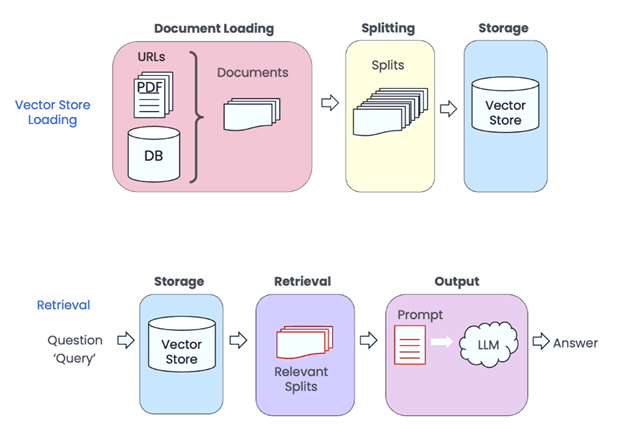

# Contents

1. [Introduction](#introduction)
2. [Suggested Learning](#suggested-learning)
3. [Development](#development)
    - [SDKs / Frameworks](#sdks--frameworks)
    - [RAG pattern](#rag-pattern)
    - [Orchestration / Agents](#orchestration--agents)
4. [Microsoft Copilot Studio - No Code / Low Code Development](#microsoft-copilot-studio---no-code--low-code-development)
5. [Vector DBs](#vector-dbs)

# Introduction

This repository aims to document the journey of learning how to use Large Language Models (LLMs) in app development. It will cover topics such as the RAG pattern, Vector DBs, Semantic Kernel, LangChain, and Microsoft Copilot Studio.

# Suggested Learning Resources

This section contains a list of recommended learning resources. It is recommended to follow the order of the courses listed below.

## LLM
- [Generative AI with Large Language Models (20+h)](https://www.coursera.org/learn/generative-ai-with-llms) - an amazing introductory course that provides a strong understanding of LLMs. Alternatively, you can watch the shorter [Intro to Large Language Models (1h)](https://www.youtube.com/watch?v=zjkBMFhNj_g).

## App Development

> DeepLearning.AI is often recomened in this section. DeepLearning.AI is led by a team of instructors from Stanford University and deeplearning.ai, offers a comprehensive platform for learning AI development. They provide a wide range of courses, specializations, and professional certificates.

- [ChatGPT Prompt Engineering for Developers (2h)](https://learn.deeplearning.ai/chatgpt-prompt-eng) and the [Prompt Engineering](https://platform.openai.com/docs/guides/prompt-engineering) article from OpenAI are recommended resources for learning prompting techniques.
- [LangChain for LLM Application Development (2h)](https://learn.deeplearning.ai/langchain/) provides insights into using LangChain for LLM development.
- [LangChain Chat with Your Data (2h)](https://learn.deeplearning.ai/langchain-chat-with-your-data/) is a course that demonstrates the use of LangChain for the RAG pattern.
- [How Business Thinkers Can Start Building AI Plugins With Semantic Kernel](https://learn.deeplearning.ai/microsoft-semantic-kernel/) introduces Semantic Kernel (SK) and provides guidance on building AI plugins with it.

### Quality.
- [Evaluating and Debugging Generative AI](https://learn.deeplearning.ai/evaluating-debugging-generative-ai) is a course that explains how to use LLM to validate responses.
- [Quality and Safety for LLM Applications](https://learn.deeplearning.ai/quality-safety-llm-applications/) another great quality and safety of outputs. 

### Introductory courses to Vector DBs.
- [Advanced Retrieval for AI with Chroma (2h)](https://learn.deeplearning.ai/advanced-retrieval-for-ai/)
- [Vector Databases: from Embeddings to Applications (2h)](https://learn.deeplearning.ai/vector-databases-embeddings-applications/) - utilizes Weaviate

For more great courses on LLMs, visit [DeepLearning.AI Short Courses](https://learn.deeplearning.ai/). DeepLearning.AI constantly adds new courses, so it is recommended to check back often. As of the beginning of 2024, DeepLearning.AI remains one of the foundational sources for learning about LLMs and app development.

### Additional resources

- [LangChain Course](https://www.youtube.com/playlist?list=PLqZXAkvF1bPNQER9mLmDbntNfSpzdDIU5): A comprehensive course exposing interesting patterns, although code samples could be outdated.
- [Develop Generative AI solutions with Azure OpenAI Service](https://learn.microsoft.com/en-gb/training/paths/develop-ai-solutions-azure-openai/): Light courses from Microsoft.
- Short but very saturated videos on Azure Open AI:
    - [Introduction to Azure OpenAI and Architecture Patterns](https://www.youtube.com/watch?v=TI85JJVPnrM)
    - [Azure OpenAI Chat With Your Data No Code Edition](https://www.youtube.com/watch?v=tFJNasjGM3E)

# Development

### Shift from Algorithmic to Heuristic Software

Application development leveraging LLM offers a shift from algorithmic approaches to heuristic methods. Heuristic methods utilize available data to solve problems, rather than relying on predefined solutions. While heuristic solutions may not always be provable or completely accurate, they are often sufficient for solving small-scale problems within a larger context.

**Heuristics vs. Algorithms.**  Algorithms provide step-by-step instructions for solving a specific problem in a finite number of steps. The outcome of an algorithm is predictable and can be reliably reproduced with the same input. On the other hand, heuristic outcomes are educated guesses. They cannot be predicted or reproduced reliably.

## SDKs / Frameworks

When developing solutions that utilize Large Language Models (LLMs), you have the choice of using API libraries or SDKs/Frameworks. Although it is feasible to solely rely on API libraries, leveraging SDKs/Frameworks can expedite solution development and reduce code complexity. It is advisable to utilize SDKs/Frameworks whenever possible.

> **Important Note:** Code-related educational material can quickly become obsolete due to the constant evolution of libraries and SDKs. It is recommended for learners to focus on application development patterns rather than specific syntax, as patterns are more resistant to change.

|                     | [OpenAI](https://platform.openai.com/docs/libraries/python-library)  | [Azure Open AI](https://learn.microsoft.com/en-us/azure/ai-services/openai/supported-languages) | [Semantic Kernel](https://learn.microsoft.com/en-us/semantic-kernel/overview/) | [LangChain](https://www.langchain.com/)       | [LlamaIndex](https://www.llamaindex.ai/)      |
| ------------------- | ----------- | ----------------- | --------------- | --------------- | --------------- |
|                     | API Library | API Library / Service SDK | SDK / Framework | SDK / Framework | SDK / Framework |
| Open Source              | yes         | yes               | yes             | yes             | yes             |
| OpenAI and Azure OpenAI models | yes         | yes               | yes             | yes             | yes             |
|                     |             |                   |                 |                 |                 |
| Framework Features (Memory, Orchestration, Agents...) |  -        |  -                | yes             | yes             | yes             |
|                     |             |                   |                 |                 |                 |
| C#                  | yes         | yes               | yes             |  -              |  -              |
| Python              | yes         | yes               | yes             | yes             | yes             |
| JS                  | yes         | yes               |  -              | yes             | yes             |

> The table above shows only three languages, but API libraries are available for many more languages. It is also important to note that updates in models are first reflected in API libraries and later frameworks.

Python has traditionally had the largest community for AI research and development. However, the C# AI community is rapidly growing thanks to the advancements in Semantic Kernel. On the other hand, JavaScript, despite being a popular language, currently lacks a mature representation in the LLM domain.

### Code Samples
This repo contains samples for the following SDKs:

- [Semantic Kernel, C#, .NET 8](/samples/CSharp/)
- [LangChain, Python](/samples/LangChain/)

### Recomendations regarding Performance, Stability and Cost

- Latency is a significant challenge in call centers where AI-powered virtual agents assist human agents. To mitigate the wait time, call centers often utilize call-waiting messages. Interfaces that incorporate visual UI can enhance response time by leveraging Streaming. For more information, refer to the [OpenAI Streaming](https://platform.openai.com/docs/api-reference/streaming) and [Azure Open AI API reference](https://learn.microsoft.com/en-us/azure/ai-services/openai/reference#:~:text=stream) documentation.
- LangChain and LlamaIndex provide an optional caching (LlamaIndex also offers remote cache management). This feature offers two advantages: it can help reduce costs by minimizing the number of API calls to the LLM provider and improve responsiveness.
- While building SaaS/Multitenant solution it's recomened to review [Multitenancy and Azure OpenAI Service](https://learn.microsoft.com/azure/architecture/guide/multitenant/service/openai) article.  It's provides guidance on how to implement multitenancy with Azure OpenAI Service.
- Putting API Management in front of two or more Azure OpenAI services can increase the number of tokens per minute (TPM) and improve stability by implementing retry logic for failed requests. You can refer to the sample code for implementing [Azure OpenAI Service Load Balancing with Azure API Management](https://learn.microsoft.com/en-us/samples/azure-samples/azure-openai-apim-load-balancing/azure-openai-service-load-balancing-with-azure-api-management/).  More advanced implementaion based on NGINX and AKS can be found in the article - [Azure OpenAI Service Multitenant Load Balancing and Token Per Minute Tracking via Prometheus Metrics](https://techcommunity.microsoft.com/t5/fasttrack-for-azure/azure-openai-service-multitenant-load-balancing-and-token-per/ba-p/3980163)

##  RAG pattern
The RAG (Retrieval-Augmented Generation) pattern used with Large Language Models (LLMs) like GPT-3 is a machine learning approach that enhances the capabilities of generative models by combining them with retrieval-based models. This technique allows the LLM to access a broader range of information than what is contained in its training data, improving its performance in tasks that require specific, detailed, or up-to-date knowledge.

[LangChain Chat With Your Data](https://learn.deeplearning.ai/langchain-chat-with-your-data) is a course that covers loading, chunking, and retrieval tactics used in RAG pattern leveraging LangChain.  The article [Advanced RAG: Small to Big Retrieval](https://towardsdatascience.com/advanced-rag-01-small-to-big-retrieval-172181b396d4) discusses Child-Parent Recursive Retriever and Sentence Window Retrieval with LlamaIndex. It also explores retrieval strategies such as Child to Parent and Window.  Semantic Kernel, combined with [Kernel Memory](https://github.com/microsoft/kernel-memory), can be utilized to implement the Retrieval-Augmented Generation (RAG) pattern.

### RAG steps

#### 1. Loading

LangChain has implemented loading from different sources and of different formats.  Semantic Kernel had this features  initially but later it was extracted to [Kernel Memory](https://github.com/microsoft/kernel-memory)

#### 2. Chunking / Splitting
Automatic chunking is challenging when we have documents of different formats. We have customers who converted important PDFs to text and then manually chunked them. This way, they were able to get the best results during the retrieval step and later the completion.

> Chunking is a crucial step in the RAG pattern. It involves not only considering the size of the chunk but also the content. For instance, if we have a document with 100 pages and only 1 paragraph is relevant to the question, we should chunk it in a way that separates the relevant paragraph into its own chunk. This allows us to retrieve the specific chunk and use it to generate a prompt.

#### 3. Embedding and Storage to Vector DB

It's important to use the same model for creating embeddings of both chunks and questions. This helps in getting better results when retrieving information and completing tasks. If organizations keep adding new documents, they might face a problem if the original embedding model they use becomes outdated and unavailable. Using a new model could lead to bad search results because it creates different embeddings. To avoid this, consider these options:

- Choose an embedding model with a distant deprecation date.
- Save the raw text of chunks along with their vectors. This enables you to regenerate embeddings using a newer model if needed, although it may increase costs.
- Download the embedding model and host it on your own infrastructure. This allows continued use even after deprecation, but it also entails additional costs.

Some Vector DBs will automatically get embedding as you save text.
Weaviate Course - https://learn.deeplearning.ai/vector-databases-embeddings-applications  

#### 4. Retrieval

There are different strategies for retrieval. Some DBs provide configurable hybrid retrieval strategies. The retrieval practices are evolving, and we see that VectorDBs are taking ownership over this step as it makes sense to filter data as close to the data source as possible. They are adding more and more features to support different retrieval strategies.

Here are some resources for advanced retrieval tactics:

- [Advanced Retrieval tactics using LlamaIndex](https://towardsdatascience.com/advanced-rag-01-small-to-big-retrieval-172181b396d4)
- [Advanced Retrieval for AI with Chroma and LangChain](https://learn.deeplearning.ai/advanced-retrieval-for-ai)

LangChain has also implemented a couple of strategies for retrieval.

#### 5. Prompting

Great list of strategies and tactics for prompting can be found here: https://platform.openai.com/docs/guides/prompt-engineering/strategy-provide-reference-text

## Orchestration / Agents

it is a ToDo section

# Microsoft Copilot Studio - No Code / Low Code Development

it is a ToDo section

Here are some resources related to Microsoft Copilot Studio:

1. [Power Virtual Agents became part of Microsoft Copilot Studio](https://powervirtualagents.microsoft.com/en-us/blog/microsoft-power-virtual-agents-now-part-of-microsoft-copilot-studio/)
2. [Transform copilot development with Microsoft Copilot Studio](https://ignite.microsoft.com/en-US/sessions/6f38dfc6-97eb-4d8d-8972-8c0a2a20c0d8?source=sessions)
3. Deployment and distribution – based on PP
4. TODO Observability is missing
5. TODO Multitenancy is not supported by the business model but can be implemented using dev techniques.

- Power Virtual Agents in a Day - https://aka.ms/PVAinaDay
- PowerPlatform ALM Lab - https://aka.ms/ppalmlab

More details around capabilities and pricing of the Power Platform offers can be found in the [Microsoft Power Platform Licensing Guide](https://go.microsoft.com/fwlink/?linkid=2085130).

You can find more information about Copilot Studio at the following links:
- [Copilot Studio website](https://aka.ms/copilotstudio)
- [Blog](https://aka.ms/copilotstudioblog)
- [Demo](https://aka.ms/copilotstudiodemo)
- [Sizzle video](https://aka.ms/copilotstudiosizzle)
- [Product documentation](https://aka.ms/copilotstudiodocs)
- [Community page](https://aka.ms/copilotstudiocommunity)

# Vector DBs

Vector databases are a new class of databases that are optimized for storing and querying vector data. They are designed to handle large volumes of vector data and provide fast, efficient, and scalable access to it. Vector databases are commonly used for RAG pattern and Semantic Caching.

> **Semantic caching** in app development is a technique where data is stored in a cache based on the semantics, or meaning, of the queries rather than the exact query text or results. This allows for more efficient use of cache space and quicker response times, as the cache can serve results for queries that are similar in meaning, even if they are not identical in form.

The following table offers an overview of common vector database across a range of characteristics. It helps in evaluating and comparing these databases based on various technical and operational aspects.

// TODO: review table

| Characteristic / Vector DB|Database Type|Storage Engine|Indexing Mechanism|Query Capabilities|Scalability|Performance|Supported Data Types|Integration and Compatibility|Security Features|Ease of Use|Community and Support|Licensing and Pricing|High Availability and Disaster Recovery|Customization and Extensibility|
|:----|:----|:----|:----|:----|:----|:----|:----|:----|:----|:----|:----|:----|:----|:----|
|Pinecone|Vector database|Cloud-native, Kubernetes|FAISS, hybrid search|Nearest neighbor, filtered|Billions of vectors|Low latency, high speed|Dense, sparse vectors|ML frameworks, cloud|Metadata key-value pairs|Simple API, user-friendly|Community support|Managed service|Cloud-native, managed|API for CRUD operations|
|Milvus|Vector database|Separates storage and compute|ANNS, multiple index types|Similarity search, DML/DDL|Horizontal scalability|Blazing fast, hardware efficient|Dense, sparse vectors|ML models, diverse environments|Isolated system components|Intuitive SDKs, easy setup|Extensive community, GitHub|Open-source, Apache 2.0 license|High availability, resilient|Flexible, feature-rich|
|Faiss by Meta|Library for similarity search|In-memory, GPU support|Various indexing methods (HNSW, PQ, etc.)|Nearest-neighbor search|Scalable on large datasets|High-performance, especially on GPU|High-dimensional vectors|C++/Python interfaces, integrates with machine learning frameworks|Not specified|User-friendly, with Python and C++ support|Extensive community and support|Open-source|GPU support enhances availability|Highly customizable, supports various algorithms|
|Chroma DB|Vector database|Not specified|Not specified|Search, filtering, query by embeddings or texts|Not specified|Not specified|Embeddings, metadata|Integrates with LangChain, LlamaIndex, OpenAI|Not specified|Simple API for Python and JavaScript|Not specified|Open-source (Apache 2.0 license)|Not specified|Not specified|
|Vald|Distributed vector DBMS|Cloud-Native architecture|Fastest ANN Algorithm NGT|Approximate nearest neighbor search|Highly scalable, distributed|Fast, distributed search engine|Dense vectors|Supports multiple languages (Golang, Java, Node.js, Python)|Customizable Ingress/Egress filtering|Easy to install and use|Active GitHub repository, Slack community|Open-source (Apache 2.0 license)|Auto Indexing Backup, Index Replication|Highly customizable, can configure vector dimensions, replicas|
|Vespa|Vector database|Distributed, scalable|ANN, lexical, structured|Search, recommendation, AI|Large datasets, high loads|Low-latency, high-performance|Structured, text, vector|Machine learning support|Secured, customizable|Customizable, extendable|Extensive documentation|Open Source, Apache 2.0|High availability, reliability|Application components, ML|
|Elasticsearch|Vector database|Lucene-based, disk storage|Lucene HNSW, ANN|Hybrid retrieval, ANN, kNN|Scales beyond RAM size|Efficient, scalable search|Unstructured, semi-structured|ML, Elastic Stack integration|Indexing, searching security|Powerful APIs, user-friendly|Robust community, support|Open Source, commercial|Incremental snapshots, reliable|Flexible APIs, integrations|
|Deep Lake|Vector database|Multi-modal, serverless|Tensor-based, multi-modal|Embedding, metadata, multi-modal|High-performance, scalable|Fast streaming, query execution|All AI data types, multi-modal|PyTorch, TensorFlow, LangChain|Data versioning, secure storage|Python API, easy setup|Community-driven, active support|Open Source, MPL-2.0|Serverless, efficient data handling|Customizable, multi-modal support|
|Qdrant|Vector database|Cloud-native|HNSW algorithm|Nearest neighbors, filterable|Scales horizontally|Fast and accurate|Various data types|API in many languages|Not specified|Easy to use API|GitHub community|Open-source|Not specified|Payload filtering, custom logic|
|Weaviate|Vector database|Cloud-native|HNSW algorithm|Vector and scalar search|Horizontally scalable|Fast queries|Text, images, etc.|GraphQL, REST, language clients|Not specified|User-friendly|GitHub community|Open-source|High availability (roadmap)|Modules, custom models|
|Azure AI Search|Cloud-based vector database|Azure infrastructure|Vector fields, embedding models|Text, image, multilingual, hybrid|Scalable service|High-performance|Text, images, various|Azure services integration|Azure security features|Simplified wizard setup|Azure community, support|Azure pricing model|Azure reliability|Configurable, chunking strategy|

